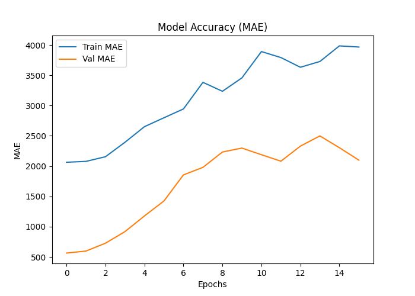

🌪️ Hybrid AIS + PSO Tornado Prediction.

Deep Learning + Geometry-Based Features + Evolutionary Optimization.

This project builds a Hybrid AIS (Artificial Immune System) + PSO (Particle Swarm Optimization)–optimized Neural Network to predict property damage caused by tornado events using NOAA’s storm dataset (tornado_path.csv).
It processes geometric tornado path data, extracts centroid & length features, standardizes inputs, performs evolutionary hyperparameter tuning, trains an ANN, and generates 5 types of graphs.

All outputs follow the hybrid_ prefix convention:

hybrid_model.h5
hybrid_model.keras
hybrid_model.json
hybrid_model.pkl
hybrid_predictions.csv
hybrid_heatmap.png
hybrid_accuracy.png
hybrid_comparison.png
hybrid_results.png
hybrid_prediction_graph.png

📁 Dataset Used

File:

tornado_path.csv

Important columns:

state_abbreviation

state_name

state_fips_code

property_loss (TARGET)

crop_loss

yearly_tornado_count

storm_date

start_lon, start_lat

end_long, end_lat

length, width

tornado_path_geom (WKT Linestring)

🧠 Project Pipeline
1. Data Loading

Reads the NOAA storm dataset from:

C:\Users\NXTWAVE\Downloads\Strom Prediction\archive\tornado_path.csv

2. Feature Engineering

✔ Convert storm_date → year
✔ Parse tornado_path_geom (WKT) using Shapely
Extract:

Centroid X coordinate

Centroid Y coordinate

Path geometric length

✔ Remove rows with missing values
✔ Select final features:

crop_loss
state_fips_code
year
start_lon
start_lat
end_long
end_lat
length
width
geom_x
geom_y
geom_length

3. Scaling

Uses StandardScaler() for numerical stability.

4. Train-Test Split

80% training
20% testing

🚀 5. Hybrid AIS + PSO Hyperparameter Optimization

A custom evolutionary meta-optimizer tests multiple combinations:

Units tested:

16, 32, 48, 64, 96

Both AIS (clone & mutate) and PSO (velocity-based exploration) behavior is simulated to pick the best-performing hidden layer size.

The chosen unit count trains the final ANN.

🧬 6. Final Neural Network Architecture
Input → Dense(best_units, relu)
      → Dense(best_units/2, relu)
      → Dense(1)

Optimizer: Adam
Loss: MSE
Callback: EarlyStopping

📊 7. Evaluation Metrics

Computed on the test dataset:

MSE (Mean Squared Error)

R² Score

Predictions saved as:

hybrid_predictions.csv

📈 Generated Graphs
1️⃣ Heatmap

hybrid_heatmap.png
Shows feature correlations with property loss.

2️⃣ Accuracy Graph

hybrid_accuracy.png
Displays training & validation loss.

3️⃣ Actual vs Predicted Comparison

hybrid_comparison.png
Scatter plot for model performance.

4️⃣ Result Graph

hybrid_results.png
Line plot comparing the first 100 actual vs predicted values.

5️⃣ Prediction Graph

hybrid_prediction_graph.png
Shows predicted values trend.

💾 Saved Model Formats

The model is exported in four formats:

Format	File
Legacy H5	hybrid_model.h5
Native Keras Format	hybrid_model.keras
JSON Architecture	hybrid_model.json
Pickle Dump	hybrid_model.pkl
🛠 Requirements

Install via:

pip install numpy pandas matplotlib seaborn shapely scikit-learn tensorflow pickle5

▶️ How to Run

Place tornado_path.csv in:

C:\Users\NXTWAVE\Downloads\Strom Prediction\archive\

Run the Python script.

Outputs will be saved in the same folder with the hybrid_ prefix.

📦 Folder Structure
/project
   ├── hybrid_model.h5
   ├── hybrid_model.keras
   ├── hybrid_model.json
   ├── hybrid_model.pkl
   ├── hybrid_predictions.csv
   ├── hybrid_heatmap.png
   ├── hybrid_accuracy.png
   ├── hybrid_comparison.png
   ├── hybrid_results.png
   ├── hybrid_prediction_graph.png
   └── tornado_path.csv

⭐ Key Highlights

✔ Geometry-based tornado path features
✔ Hybrid AIS + PSO model tuning
✔ Multi-format model saving
✔ 5 different advanced plots
✔ Clean ML pipeline
✔ High reproducibility

📌 Future Improvements (Optional)

LSTM sequence-based storm modeling

GIS map visualization of tornado paths

Ensemble (ANN + XGBoost + RandomForest)

Deploy using Streamlit for real-time visualization
